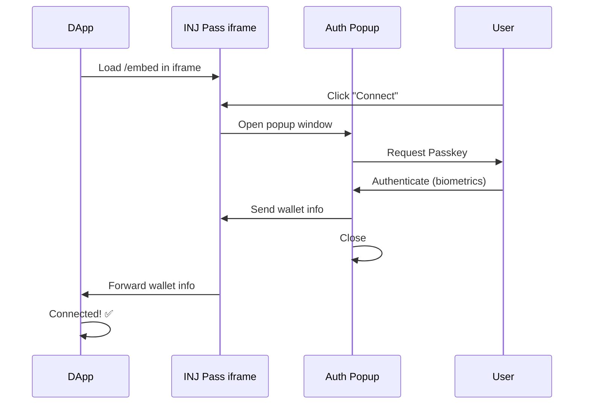

# @injpass/connector

Lightweight SDK for embedding INJ Pass wallet in your dApp via iframe.

## ⚡ What's New in v2.0

**Popup-based Authentication Architecture** - Completely redesigned to work around browser restrictions:
- ✅ **No Storage Access API needed** - Works seamlessly in Safari/Chrome without user prompts
- ✅ **Bypasses iframe WebAuthn restrictions** - Authentication happens in popup windows
- ✅ **Full Storage Partitioning compatibility** - Future-proof for Chrome's third-party cookie deprecation
- ✅ **Better security** - Origin validation and isolated authentication flow

[Read the full architecture guide →](./README_NEW_ARCHITECTURE.md)

## Features

- 🔐 **Passkey Authentication** - Secure, passwordless wallet access using WebAuthn
- 📱 **Mobile Support** - Works on iOS/Android browsers
- 🎨 **Flexible UI** - Floating, modal, or inline modes
- 🔒 **Secure** - Private keys never leave the iframe, authentication via popup
- ⚡ **Lightweight** - Zero dependencies, < 5KB gzipped
- 🔄 **Cross-dApp** - One wallet works across all dApps
- 🌐 **Universal Browser Support** - No more Storage Access API prompts!

## How It Works (v2.0 Architecture)



**Why popup windows?**
- ✅ Popup windows have full access to `localStorage` (no partitioning)
- ✅ WebAuthn works perfectly in top-level popup windows
- ✅ No browser prompts or permission requests needed
- ✅ Works identically across all browsers

## Installation

```bash
npm install @injpass/connector
```

or

```bash
pnpm add @injpass/connector
```

## Quick Start

### 1. Configure Environment Variables

Add to your `.env` file:

```bash
# Development
VITE_INJPASS_EMBED_URL=http://localhost:3001/embed

# Production (after deployment to Vercel)
# VITE_INJPASS_EMBED_URL=https://inj-pass-frontend-test.vercel.app/embed
```

### 2. Configure CSP Headers (Recommended)

Add to your HTML or HTTP headers to allow the iframe:

```html
<meta 
  http-equiv="Content-Security-Policy" 
  content="frame-src http://localhost:3001 'self'; script-src 'self' 'unsafe-inline'"
/>
```

**Note**: In v2.0, you don't need to configure `allow="publickey-credentials-get"` anymore - authentication happens in popup windows, not in the iframe!

### 3. Use the SDK

```typescript
import { InjPassConnector } from '@injpass/connector';

// Create connector instance - embedUrl is REQUIRED
const connector = new InjPassConnector({
  embedUrl: import.meta.env.VITE_INJPASS_EMBED_URL  // Vite
  // or
  // embedUrl: process.env.REACT_APP_INJPASS_EMBED_URL  // Create React App
  // embedUrl: process.env.NEXT_PUBLIC_INJPASS_EMBED_URL  // Next.js
});

// Connect to wallet
const wallet = await connector.connect();
console.log('Connected:', wallet.address);

// Sign message
const signature = await wallet.signer.signMessage('Hello World');
console.log('Signature:', signature);

// Disconnect
connector.disconnect();
```

> **Important**: 
> - `embedUrl` is now **REQUIRED** - you must provide it in the config
> - Use environment variables to manage URLs across environments
> - The SDK automatically adds Passkey permissions to the iframe

## Configuration Options

**All options:**

```typescript
const connector = new InjPassConnector({
  // REQUIRED: Embed URL
  embedUrl: import.meta.env.VITE_INJPASS_EMBED_URL,

  // Position (for floating mode)
  position: {
    bottom: '20px',
    right: '20px'
  },

  // Size
  size: {
    width: '400px',
    height: '300px'
  },

  // Display mode: 'floating' | 'modal' | 'inline'
  mode: 'floating',

  // Container ID (for inline mode)
  containerId: 'wallet-container',

  // Auto-hide after connection
  autoHide: true
});
```

### Environment Variables by Framework

**Vite:**
```bash
VITE_INJPASS_EMBED_URL=http://localhost:3001/embed
```
```typescript
embedUrl: import.meta.env.VITE_INJPASS_EMBED_URL
```

**Create React App:**
```bash
REACT_APP_INJPASS_EMBED_URL=http://localhost:3001/embed
```
```typescript
embedUrl: process.env.REACT_APP_INJPASS_EMBED_URL
```

**Next.js:**
```bash
NEXT_PUBLIC_INJPASS_EMBED_URL=http://localhost:3001/embed
```
```typescript
embedUrl: process.env.NEXT_PUBLIC_INJPASS_EMBED_URL
```

## Display Modes

### Floating Mode (Default)
Fixed position overlay that appears on top of your dApp:

```typescript
const connector = new InjPassConnector({
  mode: 'floating',
  position: { bottom: '20px', right: '20px' }
});
```

### Modal Mode
Full-screen modal with backdrop:

```typescript
const connector = new InjPassConnector({
  mode: 'modal',
  size: { width: '500px', height: '400px' }
});
```

### Inline Mode
Embedded within a container element:

```html
<div id="wallet-container" style="width: 100%; height: 500px;"></div>
```

```typescript
const connector = new InjPassConnector({
  mode: 'inline',
  containerId: 'wallet-container'
});
```

## API Reference

### InjPassConnector

#### `connect(): Promise<ConnectedWallet>`
Displays the wallet iframe and waits for user to authenticate with Passkey.

**Returns:**
```typescript
{
  address: string;           // Injective wallet address (inj1...)
  walletName?: string;       // User-defined wallet name
  signer: InjPassSigner;     // Signer instance for signing messages
}
```

**Throws:**
- `Error('Already connected')` - If already connected
- `Error('Connection timeout')` - If user doesn't authenticate within 60s
- `Error('Connection failed')` - If authentication fails

#### `disconnect(): void`
Disconnects wallet and removes iframe from DOM.

#### `show(): void`
Shows the iframe (if hidden).

#### `hide(): void`
Hides the iframe.

### InjPassSigner

#### `signMessage(message: string): Promise<Uint8Array>`
Signs a message using the wallet's private key (secp256k1).

**Parameters:**
- `message`: String message to sign

**Returns:**
- `Promise<Uint8Array>`: 64-byte signature (r + s)

**Throws:**
- `Error('Signing timeout')` - If signing takes > 30s
- `Error(...)` - If user rejects or signing fails
## Security Considerations

### 1. Content Security Policy (CSP)

**Recommended**: Add `frame-src` directive to your CSP:

```html
<!-- Development -->
<meta http-equiv="Content-Security-Policy" 
      content="frame-src http://localhost:3001 'self'" />

<!-- Production -->
<meta http-equiv="Content-Security-Policy" 
      content="frame-src https://your-injpass-domain.com 'self'" />
```

### 2. Popup Windows (New in v2.0)

The SDK uses popup windows for authentication:
- ✅ Popups run in top-level browsing context (full storage access)
- ✅ WebAuthn works without restrictions
- ✅ Origin validation prevents unauthorized access
- ⚠️ Users must allow popups for your site

### 3. Origin Validation

The SDK validates message origins automatically:
- Development: Allows `localhost` and same-origin
- Production: Can be configured with whitelist (contact support)

### 4. Private Key Isolation

- Private keys are encrypted and stored in the INJ Pass domain only
- Keys never leave the secure context
- Only signatures are transmitted via postMessage
- Popup window closes immediately after authentication

### 5. HTTPS Only

The wallet works on:
- ✅ `https://` origins
- ✅ `http://localhost` (development only)
- ❌ Other `http://` origins are blocked
## Troubleshooting

### ❌ "Popup blocked"

**Error:** Popup window doesn't open when clicking connect.

**Solution:**
1. Click "Always allow popups from this site" in browser
2. Ensure `connect()` is called directly from user interaction (not in async callback)
3. Check browser settings to allow popups

### ❌ "Connection timeout"

**Causes:**
1. CSP blocks iframe loading
2. User doesn't have platform authenticator
3. Network issues
4. User closed popup without authenticating

**Solutions:**
- Check CSP allows the iframe origin
- Verify user device has Touch ID/Face ID/Windows Hello
- Check browser console for iframe load errors
- Ensure `embedUrl` is correct

### ❌ "No wallet found"

**Solution:**
1. Create wallet at your INJ Pass instance's `/welcome` page
2. For local development: `http://localhost:3001/welcome`
3. The embed page will guide users to create wallet if none exists

### ❌ "Origin mismatch" in console

**Normal in development**: You may see origin warnings in development mode - these are informational only and won't block functionality.

**In production**: If you need strict origin whitelisting, contact support.

## Browser Support

| Browser | Version | Status | Notes |
|---------|---------|--------|-------|
| Chrome | 67+ | ✅ Full support | Desktop & Android |
| Safari | 16+ | ✅ Full support | macOS & iOS - No Storage Access prompt needed! |
| Edge | 79+ | ✅ Full support | Chromium-based |
| Firefox | 60+ | ✅ Full support | Desktop & Android |

**Requirements:**
- ✅ WebAuthn platform authenticator (Touch ID/Face ID/Windows Hello)
- ✅ Browser must support `window.open()` for popups
- ✅ JavaScript enabled

## Version History

### v2.0.0 (2026-02-24) - Major Architecture Update
- 🎉 **Complete rewrite**: Popup-based authentication architecture
- ✅ **No more Storage Access API prompts** in Safari
- ✅ **Bypasses iframe WebAuthn restrictions**
- ✅ **Future-proof** for Chrome's third-party cookie deprecation
- ✅ Relaxed origin validation (allows localhost in dev mode)
- 📝 Comprehensive documentation update
- 🔧 Improved error handling and timeout management

### v0.1.4 (2026-02-23)
- 🐛 Bug fixes and stability improvements
- 📝 Documentation updates

### v0.1.1 (2026-02-23)
- ✅ Added Permissions Policy support for WebAuthn
- ✅ Automatically adds `allow` attribute to iframe
- 📝 Updated documentation with troubleshooting guide

### v0.1.0 (2026-02-23)
- 🎉 Initial release
- ✅ Passkey-based authentication
- ✅ Floating, modal, and inline modes
- ✅ Cross-dApp wallet sharing

## Migration from v0.x to v2.0

**Good news:** The API is 100% backward compatible! Just update:

```bash
npm update @injpass/connector
```

**What changed internally:**
- Authentication now happens in popup windows instead of directly in iframe
- No code changes needed in your dApp
- Better browser compatibility automatically

**Optional improvements:**
- Remove any Storage Access API handling code
- Update CSP to remove unnecessary permissions-policy directives

## Best Practices

### 1. Environment-based Configuration
```typescript
const connector = new InjPassConnector({
  embedUrl: process.env.NODE_ENV === 'production'
    ? 'https://your-production-injpass.com/embed'
    : 'http://localhost:3001/embed'
});
```

### 2. Handle Popup Blockers
```typescript
try {
  const wallet = await connector.connect();
  setWallet(wallet);
} catch (error) {
  if (error.message.includes('Popup blocked')) {
    alert('Please allow popups for this site to connect your wallet.');
  } else if (error.message.includes('timeout')) {
    alert('Connection timed out. Please try again.');
  } else {
    alert('Connection failed: ' + error.message);
  }
}
```

### 3. User Feedback
```typescript
setLoading(true);
setStatus('Opening authentication window...');
try {
  const wallet = await connector.connect();
  setStatus('Connected successfully!');
  setConnected(true);
} catch (error) {
  setStatus('Connection failed');
} finally {
  setLoading(false);
}
```

### 4. Test Before Production
- Test on multiple browsers (Chrome, Safari, Firefox, Edge)
- Test on mobile devices (iOS Safari, Android Chrome)
- Test with different popup blocker settings
- Ensure popups work on first user interaction

## Framework Examples

### React
```tsx
import { InjPassConnector } from '@injpass/connector';
import { useState } from 'react';

function WalletButton() {
  const [connector] = useState(() => new InjPassConnector({
    embedUrl: import.meta.env.VITE_INJPASS_EMBED_URL
  }));
  const [wallet, setWallet] = useState(null);
  const [loading, setLoading] = useState(false);

  const connect = async () => {
    setLoading(true);
    try {
      const w = await connector.connect();
      setWallet(w);
    } catch (error) {
      if (error.message.includes('Popup blocked')) {
        alert('Please allow popups for this site');
      }
      console.error(error);
    } finally {
      setLoading(false);
    }
  };

  const sign = async () => {
    if (!wallet) return;
    
    try {
      const sig = await wallet.signer.signMessage('Hello INJ Pass!');
      console.log('Signature:', sig);
    } catch (error) {
      console.error('Signing failed:', error);
    }
  };

  return (
    <div>
      {!wallet ? (
        <button onClick={connect} disabled={loading}>
          {loading ? 'Connecting...' : 'Connect Wallet'}
        </button>
      ) : (
        <>
          <p>Connected: {wallet.address}</p>
          <button onClick={sign}>Sign Message</button>
          <button onClick={() => connector.disconnect()}>Disconnect</button>
        </>
      )}
    </div>
  );
}
```

### Vue 3
```vue
<script setup>
import { InjPassConnector } from '@injpass/connector';
import { ref } from 'vue';

const connector = new InjPassConnector({
  embedUrl: import.meta.env.VITE_INJPASS_EMBED_URL
});

const wallet = ref(null);
const loading = ref(false);

async function connect() {
  loading.value = true;
  try {
    wallet.value = await connector.connect();
  } catch (error) {
    console.error(error);
    alert('Connection failed: ' + error.message);
  } finally {
    loading.value = false;
  }
}

async function signMessage() {
  if (!wallet.value) return;
  
  try {
    const signature = await wallet.value.signer.signMessage('Hello!');
    console.log('Signature:', signature);
  } catch (error) {
    console.error(error);
  }
}
</script>

<template>
  <div>
    <button v-if="!wallet" @click="connect" :disabled="loading">
      {{ loading ? 'Connecting...' : 'Connect Wallet' }}
    </button>
    <div v-else>
      <p>Connected: {{ wallet.address }}</p>
      <button @click="signMessage">Sign Message</button>
    </div>
  </div>
</template>
```

### Next.js (App Router)
```tsx
'use client';

import { InjPassConnector } from '@injpass/connector';
import { useState } from 'react';

export default function WalletConnect() {
  const [connector] = useState(() => new InjPassConnector({
    embedUrl: process.env.NEXT_PUBLIC_INJPASS_EMBED_URL!
  }));
  const [wallet, setWallet] = useState(null);

  const connect = async () => {
    try {
      const w = await connector.connect();
      setWallet(w);
    } catch (error) {
      console.error(error);
    }
  };

  return (
    <button onClick={connect}>
      {wallet ? `Connected: ${wallet.address}` : 'Connect'}
    </button>
  );
}
```

### Vanilla JavaScript
```html
<!DOCTYPE html>
<html>
<head>
  <title>INJ Pass Demo</title>
</head>
<body>
  <button id="connect-btn">Connect Wallet</button>
  <div id="status"></div>

  <script type="module">
    import { InjPassConnector } from '@injpass/connector';

    const connector = new InjPassConnector({
      embedUrl: 'http://localhost:3001/embed'
    });

    document.getElementById('connect-btn').addEventListener('click', async () => {
      try {
        const wallet = await connector.connect();
        document.getElementById('status').textContent = 
          `Connected: ${wallet.address}`;
      } catch (error) {
        alert('Failed: ' + error.message);
      }
    });
  </script>
</body>
</html>
```

## License

MIT

## Support

- 📖 Documentation: https://docs.injpass.com
- 🐛 GitHub Issues: https://github.com/injective/inj-pass/issues
- 💬 Discord: https://discord.gg/injective
- 📦 NPM Package: https://www.npmjs.com/package/@injpass/connector

---

Made with ❤️ by the INJ Pass Team
